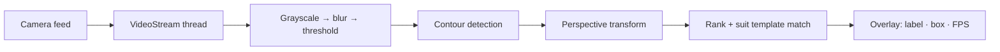

<p align="center">
  
</p>

<p align="center">
  
  
  
  
  
</p>

<p align="center">
  A real-time computer-vision system that detects standard playing cards from a live camera feed
  and identifies their <b>rank and suit</b> — isolating cards with contours, flattening them with a<br>
  perspective transform, and matching against 52 reference templates at ~10 FPS.
</p>

---

## ✨ What it does

- 🃏 **Real-time detection** — reads frames from a Raspberry Pi camera or USB webcam and identifies
  every card in view, live.
- 🔍 **Contour isolation** — grayscale → blur → threshold → contour detection finds large
  card-shaped rectangles (handles multiple cards in frame).
- 📐 **Perspective transform** — warps each detected card to a flat, standard orientation before
  reading it.
- 🎯 **Template matching** — crops the rank & suit corners and matches them against 13 ranks × 4
  suits = 52 reference images in [`Card_Imgs/`](Card_Imgs/).
- ⚡ **Threaded capture** — `VideoStream.py` grabs frames in a background thread so the detection
  loop never blocks, with a live FPS overlay.

## 🏗 Architecture



## 🗂 Project structure

```text
├── Card_Detector.py    # Main loop — capture, detect, display
├── Cards.py            # Card processing + rank/suit matching logic
├── VideoStream.py      # Threaded camera-stream class
└── Card_Imgs/          # 13 rank + 4 suit reference templates
```

## 🚀 Setup & run

```bash
pip install opencv-python numpy
# Raspberry Pi camera support (optional):
pip install picamera

python Card_Detector.py     # press 'q' to quit
```

**Camera selection** — line 29 of `Card_Detector.py`:

```python
# Raspberry Pi camera:
videostream = VideoStream.VideoStream((1280, 720), 10, 1, 0).start()
# USB webcam: change the 3rd argument from 1 to 2
videostream = VideoStream.VideoStream((1280, 720), 10, 2, 0).start()
```

## 🧰 Stack

| Layer | Tech |
| ----- | ---- |
| Language | Python 3 |
| Vision | OpenCV (threshold, contours, warp, template match) |
| Math | NumPy |
| Capture | Threaded video stream — Pi camera or USB webcam |
